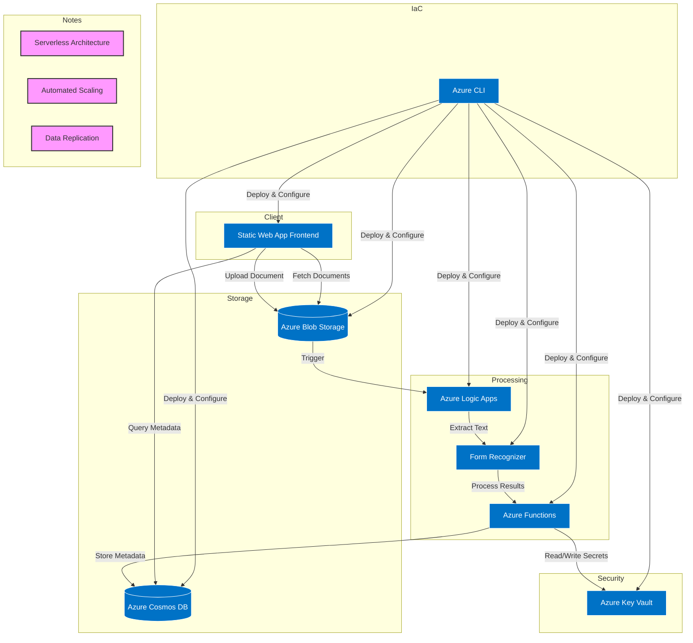

# PaperPulse
Automatic Document Processing Platform with as little code as possible in Azure.

## Architecture

```mermaid
flowchart TB
    subgraph Client
        UI[Static Web App Frontend]
    end

    subgraph Security
        KV[Azure Key Vault]
    end

    subgraph Storage
        BS[(Azure Blob Storage)]
        CDB[(Azure Cosmos DB)]
    end

    subgraph Processing
        LA[Azure Logic Apps]
        FR[Form Recognizer]
        FA[Azure Functions]
    end

    subgraph IaC
        CLI[Azure CLI]
    end

    %% Flow of data and control
    UI -->|Upload Document| BS
    BS -->|Trigger| LA
    LA -->|Extract Text| FR
    FR -->|Process Results| FA
    FA -->|Store Metadata| CDB
    FA -->|Read/Write Secrets| KV
    UI -->|Query Metadata| CDB
    UI -->|Fetch Documents| BS

    %% Infrastructure provisioning
    CLI -->|Deploy & Configure| UI
    CLI -->|Deploy & Configure| BS
    CLI -->|Deploy & Configure| LA
    CLI -->|Deploy & Configure| FR
    CLI -->|Deploy & Configure| FA
    CLI -->|Deploy & Configure| CDB
    CLI -->|Deploy & Configure| KV

    %% Styling
    classDef azure fill:#0072C6,color:#fff,stroke:#fff
    class UI,BS,LA,FR,FA,CDB,KV,CLI azure
    
    %% Add notes
    subgraph Notes
        note1[Serverless Architecture]
        note2[Automated Scaling]
        note3[Data Replication]
    end
    
    style note1 fill:#f9f,stroke:#333,stroke-width:2px
    style note2 fill:#f9f,stroke:#333,stroke-width:2px
    style note3 fill:#f9f,stroke:#333,stroke-width:2px
```

