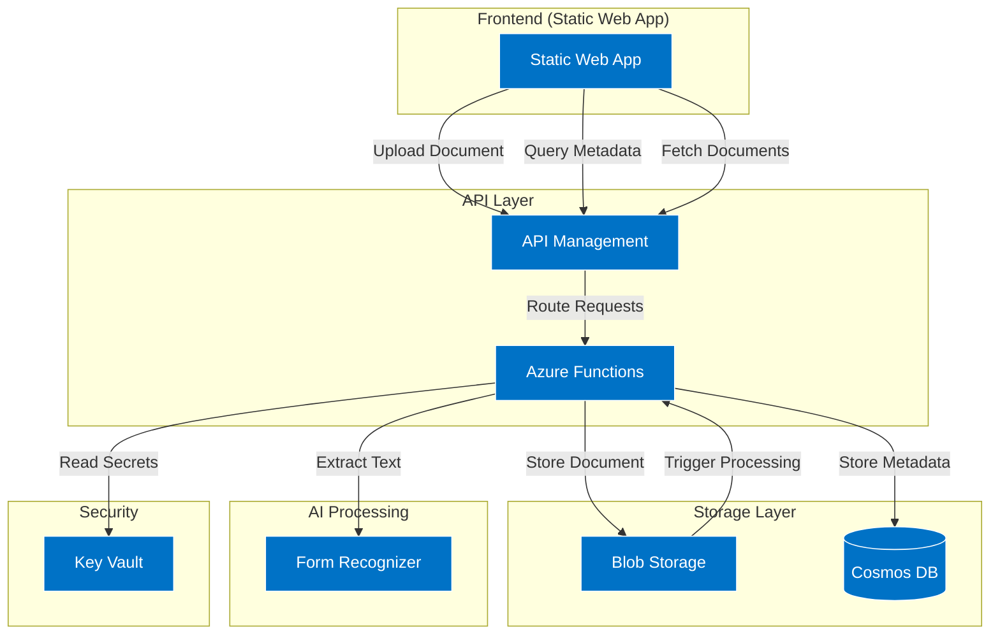

# PaperPulse - Intelligent Document Processing Platform

PaperPulse is a serverless document processing platform built on Azure that automatically analyzes and extracts information from uploaded documents using Azure's AI services. It provides a web interface for document upload, processing status monitoring, and metadata retrieval.

The platform can detect and process different types of documents including:
- Invoices
- Receipts 
- Business Cards
- General Documents

## Architecture



## Azure Resources

- **Azure Static Web App**: Hosts the React-based frontend application
- **Azure API Management**: Manages the API endpoints and provides security/throttling
- **Azure Functions**: Serverless backend implementation with endpoints for:
  - Document upload
  - Document processing
  - Metadata retrieval
  - Document listing
  - Document deletion
- **Azure Blob Storage**: Stores the uploaded documents
- **Azure Cosmos DB**: Stores document metadata and processing results
- **Azure Form Recognizer**: AI service for document analysis and data extraction
- **Azure Key Vault**: Securely stores connection strings and API keys

## Quick Start

1. **Prerequisites**
   ```bash
   # Install Azure CLI
   winget install Microsoft.AzureCLI
   
   # Install Azure Functions Core Tools
   npm install -g azure-functions-core-tools@4
   
   # Install Bicep CLI
   az bicep install
   ```

2. **Deploy Infrastructure**
   ```powershell
   # Login to Azure
   az login
   
   # Deploy resources
   ./deploy_paperpulse.ps1 -EnvironmentName "dev" -Location "eastus2"
   ```

3. **Deploy Backend**
   ```powershell
   # Deploy Azure Functions
   ./deploy_functions.ps1 -ResourceGroupName "rg-dev" -FunctionAppName "<function-app-name>"
   ```

4. **Deploy Frontend**
   ```bash
   cd frontend/paperpulse-frontend
   npm install
   npm run build
   # Deploy to Static Web App using GitHub Actions or Azure CLI
   ```

## In-Depth Documentation

### Infrastructure Setup

The infrastructure is defined using Azure Bicep templates in the `infrastructure` folder:

- `main.bicep`: Root template orchestrating the deployment
- `modules/*.bicep`: Individual resource templates for each Azure service

Deployment follows this sequence:
1. Storage resources (Blob Storage, Cosmos DB)
2. Cognitive Services (Form Recognizer)
3. Function App
4. Key Vault
5. Web App
6. API Management

### Backend Implementation

The backend is implemented as Azure Functions using .NET 8 isolated process model:

- **Document Processing Pipeline**:
  1. `UploadDocument.cs`: Handles document upload to Blob Storage
  2. `ProcessDocument.cs`: Blob trigger function that processes new documents
  3. `DocumentProcessor.cs`: Core service for document analysis
  4. `ListDocuments.cs`: Retrieves processed documents
  5. `GetDocumentMetadata.cs`: Gets specific document metadata
  6. `DeleteDocument.cs`: Removes documents and metadata

The backend uses dependency injection and follows clean architecture principles.

### Security Features

- All secrets are stored in Azure Key Vault
- RBAC (Role-Based Access Control) for service-to-service authentication
- API Management for request validation and throttling
- Function-level authorization using function keys
- HTTPS-only communication
- Managed Identities for Azure resources

### Document Processing

The `DocumentProcessor` service can detect and process different document types:
1. Attempts to classify document as Invoice/Receipt/Business Card
2. Extracts relevant fields based on document type
3. Stores metadata in Cosmos DB
4. Maintains original document in Blob Storage

### Development Setup

1. **Local Development Prerequisites**
   ```powershell
   # Install development tools
   ./install_functions_tools.ps1
   ```

2. **Local Settings**
   - Copy `local.settings.json.template` to `local.settings.json`
   - Update with your development environment values

3. **Running Locally**
   ```powershell
   cd backend
   func start
   ```

### Cleaning Up Resources

To remove all deployed resources:
```powershell
./cleanup_paperpulse.ps1 -EnvironmentName "dev"
```

---

## Pitfalls and Hard-Learned Lessons

### Azure Functions Isolated Worker Issues

#### Linux Host Plan Limitations 🚫

One of the most significant and time-consuming issues we encountered was with Linux-based function apps using isolated workers. The critical problem:

**KeyVault-referenced WebJobsStorage connection strings DO NOT work with Linux host plans when using isolated workers.**

```bicep
// This configuration WILL FAIL on Linux hosts!
{
  name: 'AzureWebJobsStorage'
  value: '@Microsoft.KeyVault(SecretUri=https://...)'
}
```

The deployment appears to succeed but results in cryptic 500/502 errors. The function app cannot retrieve its own code from blob storage because the KeyVault reference fails silently. This issue is particularly frustrating because:
- No clear error messages are provided
- The deployment seems successful initially
- Logs don't indicate the actual problem
- Microsoft's documentation doesn't mention this limitation

**Solution**: Use Windows host plan for isolated worker functions or provide the storage connection string directly (not via KeyVault reference).

#### Version Compatibility Matrix Confusion

The documentation around version compatibility between different components is often incorrect or outdated:

```xml
<!-- This combination might not work despite docs saying it should -->
<PropertyGroup>
    <TargetFramework>net8.0</TargetFramework>
    <AzureFunctionsVersion>v4</AzureFunctionsVersion>
</PropertyGroup>
```

Real-world tested working combinations:
- .NET 8 + Functions v4 + Worker v2.0.0
- .NET 7 + Functions v4 + Worker v1.x.x

### Deployment Issues

#### ZipDeploy Failures

The `deploy_functions.ps1` script may fail with unhelpful error messages:

```powershell
# Common error scenario
Error Code: 500
Error Message: Internal Server Error
# But the real issue is often the Linux/KeyVault problem described above
```

Troubleshooting steps:
1. Check logs
2. Verify host OS (Windows/Linux)
3. Check storage account connectivity
4. Validate connection string format

#### Local Development Gotchas

Local development can be misleading because:
- Local storage emulator works fine with KeyVault references
- Some features work locally but fail in Azure
- Different behavior between Windows/WSL/Linux

```bicep
 Both of these are required
resource storageBlobDataOwnerRole 'Microsoft.Authorization/roleAssignments@2022-04-01' = {
  // For document stora
resource storageFileDataSmbShareContributorRole 'Microsoft.Authorization/roleAssignments@2022-04-01' 
  // For function code strage
}
```

### Monitoring Limitations

- Application Insights doesn't always capture all errors in isolated workers
- Some logs are only available in the Kudu console
- Custom logging may not work as expected in isolated process model

### Development Workflow Issues

#### Testing Challenges

- Local testing doesn't catch all deployment issues
- Authentication flows may work locally but fail in Azure

### Recommendations

1. **Always use Windows host plan** for isolated workers until Linux issues are fully resolved

2. **Avoid KeyVault references** for critical connection strings:
```bicep
// Safer approach
resource functionApp 'Microsoft.Web/sites@2021-03-01' = {
  properties: {
    siteConfig: {
      appSettings: [
        {
          name: 'AzureWebJobsStorage'
          value: storageConnectionString // Direct value
        }
      ]
    }
  }
}
```

3. **Use deployment scripts with retry logic**:

```powershell
function Deploy-WithRetry {
    param($attempts = 3)
    for ($i = 1; $i -le $attempts; $i++) {
        try {
            # Deployment code
            return
        }
        catch {
            Write-Warning "Attempt $i failed: $_"
            Start-Sleep -Seconds ($i * 10)
        }
    }
    throw "Deployment failed after $attempts attempts"
}
```

This pitfalls section should save others from the hours of troubleshooting we endured. Most of these issues are not well documented and required extensive trial and error to resolve.

## License

This project is licensed under the MIT License - see the LICENSE file for details.
