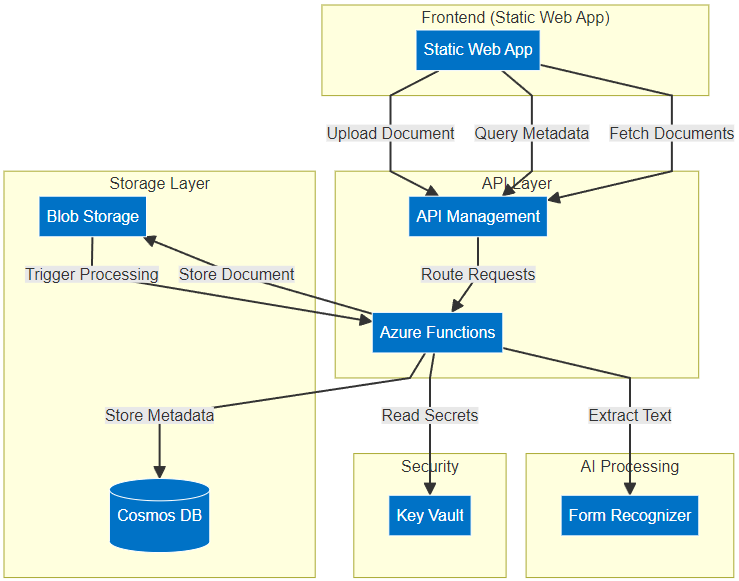

# PaperPulse
## Serverless Document Processing Platform

---

# Overview

- Automatic document analysis and metadata extraction
- Built entirely on Azure serverless architecture
- Focus on scalability and cost efficiency
- Infrastructure as Code (IaC) with Azure Bicep

---

# Architecture

---

# Key Cloud Features

- **Serverless Architecture**
  - Azure Functions
  - Pay-per-use model
  - Auto-scaling

- **Managed Services**
  - Cosmos DB for NoSQL storage
  - Form Recognizer for AI processing
  - Key Vault for secrets

---

# Cost Analysis

| Service | Pricing |
|---------|---------|
| Azure Functions | $0.20 per million executions |
| Cosmos DB | $10-100 |
| Blob Storage | $0.02/GB (hot) |
| Form Recognizer | $1.50 per 1,000 pages (0-1M) |
| API Management | $0.042 per 10,000 API operations *(consumption)* |
| Static Web App | 	$9/app/month *(production use)* |

*No initial costs! Can be expensive depending on usage and replica configuration*

Source: https://azure.microsoft.com/en-us/pricing/details/

---

# Scalability & Performance

- **Auto-scaling** at every layer
  - Functions scale to zero
  - Cosmos DB auto-scales
  - Blob storage virtually unlimited

- **High Availability**
  - Multi-region deployment options
  - Built-in redundancy
  - Automatic failover

---

# Security Implementation

- Azure Key Vault integration
- Managed Identities
- RBAC for service access
- HTTPS-only communication
- API Management security

---

# Live Demo Time

---

# Key Learnings

- Serverless isn't always simpler
- Scripting saves time
- Azure documentation can be misleading
- Cost optimization requires planning
- Infrastructure as Code is essential
- https://github.com/Azure/Azure-Functions/issues/2248

---

# Thank You!

Questions?

[GitHub Repository](https://github.com/xaverb/paperpulse)